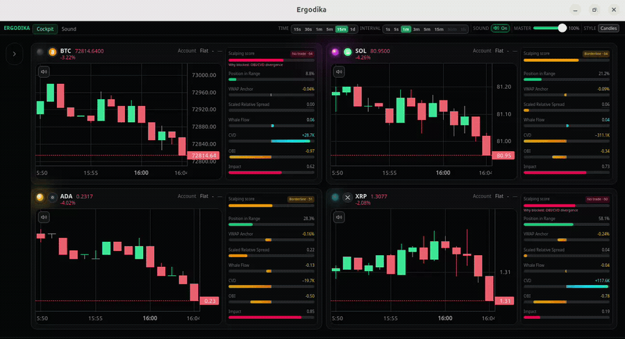

# Ergodika — Full-Stack Architecture Brief

> **Public engineering portfolio document.** Application source (SvelteKit + Tauri + Rust) lives in the private codebase. These guides explain **how Ergodika is designed and built** so reviewers can assess architecture, trade-offs, and module boundaries without cloning proprietary code.

## What Ergodika is

Ergodika is a **desktop-first crypto market cockpit** that turns live order flow into **high-density visuals and optional sonification** — read-only toward exchanges, built for traders who need situational awareness under time pressure.

## Tech stack (summary)

| Layer | Technologies |
|-------|----------------|
| Desktop shell | **Tauri 2** (native WebView) |
| Frontend | **SvelteKit 2**, **Svelte 5**, **TypeScript**, **Tailwind 4** |
| Backend | **Rust** (`live_feed`, `credentials`, `audio_engine`) |
| Charts | **lightweight-charts** v5 |
| Audio I/O | **cpal**, lock-free **SPSC** queues, realtime DSP in Rust |
| Market data | **Binance Spot** (WSS + REST) |
| Security | **AES-256-GCM** vault, OS keyring (file fallback on WSL) |
| Quality | **Vitest**, schema-first **IPC contract** + Rust alignment tests |

## What each language guide covers

- Runtime architecture (desktop vs silent browser demo)
- Design invariants (no fake market data, read-only, IPC contract)
- Repository map for the private application tree
- Market ingestion, order-flow metrics, UI (Quartet + V-Matrix + **Scalping score**)
- **Rust audio DSP pipeline** (desktop MVP): threads, mapping, realtime constraints
- Security model, testing, engineering highlights, roadmap

## Select your language

- 🇬🇧 [English](lang/ERGODIKA_FULLSTACK.en.md)
- 🇮🇹 [Italiano](lang/ERGODIKA_FULLSTACK.it.md)
- 🇷🇺 [Русский](lang/ERGODIKA_FULLSTACK.ru.md)
- 🇨🇳 [中文](lang/ERGODIKA_FULLSTACK.zh.md)
- 🇰🇷 [한국어](lang/ERGODIKA_FULLSTACK.ko.md)

*Last aligned with product state: May 2026.*
